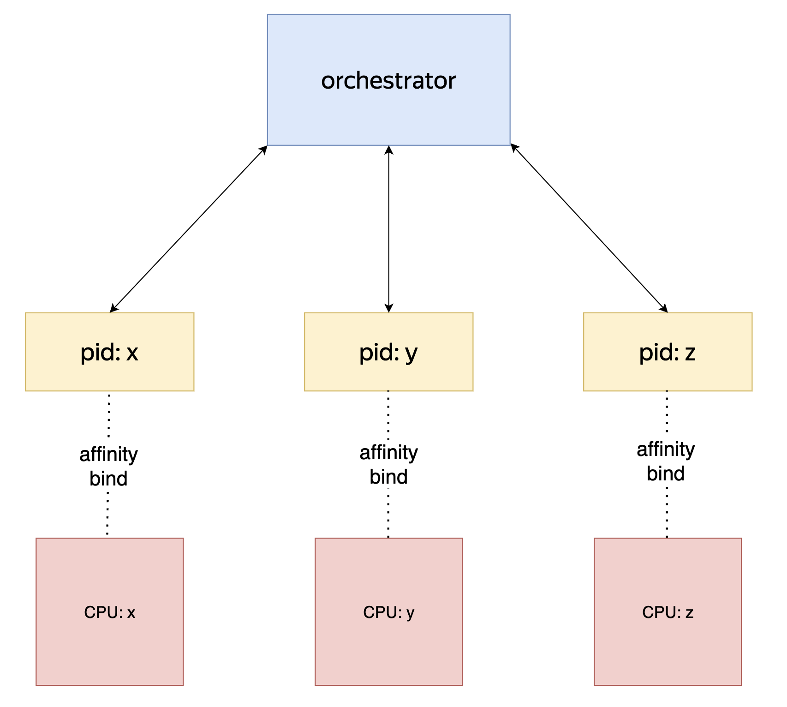
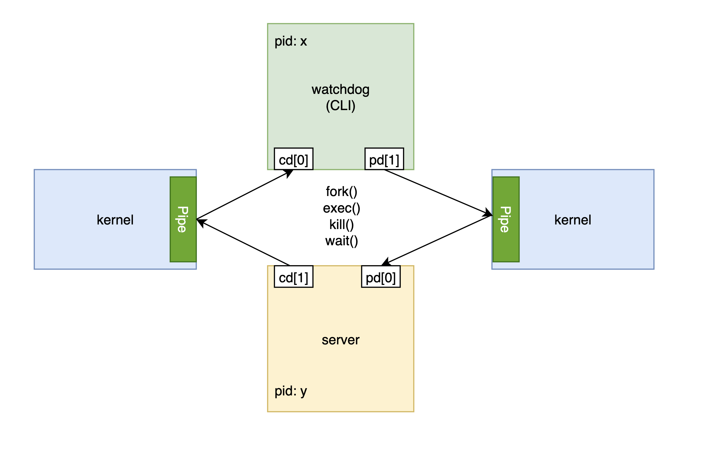

## Введение

На лекциях мы обсудили [возможность привязки](https://en.wikipedia.org/wiki/Processor_affinity) процесса/потока к определенному ядру на разных операционных системах, рассмотрели примеры, когда этим можно пользоваться. В таких случаях мы также сталкиваемся с задачей [межпроцессорного взаимодействия](https://en.wikipedia.org/wiki/Inter-process_communication). В ходе этого домашнего задания вы познакомитесь с одним из подходов для решения данной задачи ([two-way pipe communication](https://en.wikipedia.org/wiki/Anonymous_pipe)).

## **Задание**

Необходимо поддержать взаимодействие между двумя процессами, используя FIFO-каналы операционной системы (pipes). Первый процесс будет предоставлять CLI интерфейс для взаимодействия со вторым. В тестах подразумевается, что решение будет работать на linux, darwin и windows по модулю спецэффектов версии и системных сигналов (стоит ориентироваться на тесты)

## Архитектура

### **watchdog**

CLI интерфейс, отвечающий за запуск, взаимодействие и управлением сервера

1. SetMemoryLimitCommand = `setmeml <digit>`
2. SetGomaxprocs = `setproc <digit>`
3. DoRequest = `doreq <http method> <url> <request body>`
4. Exit = `exit`

**Примеры:**

`setmeml 123000`

`setproc 32`

`doreq GET http://127.0.0.1:8080 {"arg": "body"}`

`doreq POST http://127.0.0.1:8080 {"arg": "body"}`

`exit`

**Аргументы запуска:**

`-sp` - абсолютный путь к исполняемому файлу сервера (*-sp /etc/server)*

`-sargs` - аргументы, который необходимо передать серверу при запуске (*-sargs “state=c, test=123”)*

> При запуске должны наследоваться переменные окружения
>

### **server**

Компонент, который удовлетворяет интерфейсу взаимодействия с watchdog. Сервер принимает сообщение от watchdog по соглашению:

`<opByte> data <endSymbol>`  (без пробелов, коллизии в данном случае допускаются)

**Примеры:**

`1{Value: 1}#`

> Структуры сообщений, разделители и ограничения задекларированы в моделях домашнего задания
>

> О способах управления и отслеживания рантайма Go с помощью вышеперечисленных пакетов будет рассказано подробнее на следующих неделях
>

Помимо всего, сервер должен уметь корректно завершать работу, обрабатывая системный сигнал `*SIGALRM*`

## Особенности реализации

- Необходимо подумать о передаче дескрипторов и наследовании переменных окружения на различных операционных системах
- При запуске сервера нужно подумать о последующем его отключении, также стоит учитывая блокирующую/неблокирующую семантику используемых источников
- Стоит учитывать специфику различных операционных систем, корректно обрабатывая различные системные вызовы на стороне сервера
- Лучше использовать буферизированное чтение как с точки зрения удобства встроенных методов, так и с точки зрения оптимизации

# Дополнительные материалы

(практически вся информация для выполнения ДЗ будет на лекциях)

- [Unix pipe](https://en.wikipedia.org/wiki/Pipeline_(Unix))
- [Go issue about blocking io sources](https://github.com/golang/go/issues/24842)
- [Fork & exec (without C/C++)](https://dzen.ru/a/ZVN7dLY6yFZqIaEw)
- [Graceful shutdown with syscall notification](https://habr.com/ru/articles/771626/)
- [How to start a process in background](https://www.golinuxcloud.com/golang-monitor-background-process/)